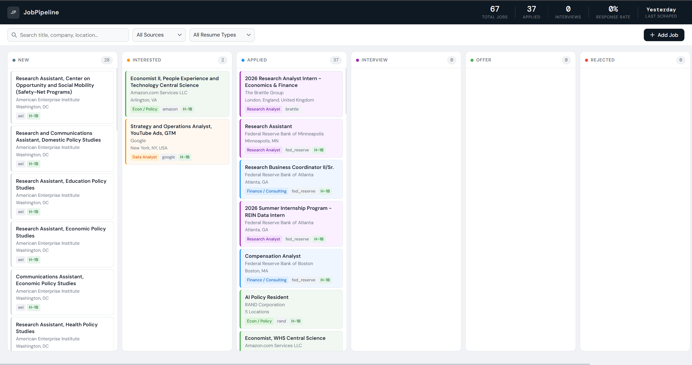

# JobPipeline

A local, SQLite-backed job scraper, LLM scorer, and Kanban dashboard built for a single job-seeker's pipeline.



## Why this exists

I'm finishing an MS Economics at Northeastern in May 2026, searching a narrow target list of employers on a short timeline. Generic job boards return too much noise for a search that specific — most matches are senior-level, PhD-required, or out-of-country. This tool scrapes a curated list of employer career pages directly, scores each posting against four resume versions using Claude, and surfaces only the ~5–10% of postings that actually fit.

## What it does

- **Scrapes 18 employer career sites daily** — economic consulting (Analysis Group, Brattle, NERA, Compass Lexecon, CRA, Cornerstone), policy/research (Brookings, RAND, Urban Institute, AEI, Mathematica, Abt), finance research (JPMorgan, Moody's, S&P Global), tech (Amazon, Google), and Fed Boston. Scrapers live in `scrapers/` — add or disable employers in `scrapers/run_all.py`.
- **Stores jobs in local SQLite** with URL-based deduplication, so repeated runs don't re-surface the same posting.
- **Scores new jobs against four resume versions** (Econ Policy, Finance/Consulting, Data Analyst, Research Analyst) using Claude Haiku. Returns a structured JSON: score 0–100, best-fit resume, disqualification flag, and inferred country.
- **Auto-dismisses jobs below a configurable threshold** (default 75) so they don't clutter the dashboard, but keeps the row so the same posting can't be re-scraped into "New" next day.
- **Tags H-1B sponsors** from a local JSON of recent sponsor data in `h1b_sponsors.py`.
- **Flask API + vanilla-JS Kanban dashboard** for reviewing scored jobs, moving them across status columns (New → Interested → Applied → Interview → Offer / Rejected / Dismissed), and generating a tailored resume + cover letter per job via Claude Opus.
- **Logs each run** to `logs/YYYY-MM-DD.log`.

## Architecture

```
 ┌──────────────┐   ┌─────────────┐   ┌──────────────┐   ┌───────────────┐
 │  18 Scrapers │──>│   SQLite    │──>│  Scorer      │──>│  Auto-dismiss │
 │  (Playwright │   │  jobs.db    │   │  (Haiku,     │   │  below 75%    │
 │  + BS4)      │   │  URL unique │   │   4 resumes) │   │               │
 └──────────────┘   └──────┬──────┘   └──────────────┘   └──────┬────────┘
                           │                                    │
                           v                                    v
                    ┌──────────────────────────────────────────────┐
                    │  Flask API + Kanban dashboard (localhost:5000)│
                    │  • review, status-track, search               │
                    │  • generate tailored resume + cover letter    │
                    │    via Claude Opus (optional)                 │
                    └──────────────────────────────────────────────┘
```

One daily entrypoint (`daily_run.py`) runs the four phases in order: scrape → score → auto-dismiss → H-1B tag.

## Tech stack

- **Python 3.10+**
- **Playwright** + **BeautifulSoup** for scraping (JS-rendered and static pages both)
- **SQLite** for storage (no server; `data/jobs.db`)
- **Anthropic Python SDK** — Haiku for scoring, Sonnet for resume tailoring, Opus for cover letters
- **Flask** backend; vanilla HTML/JS/CSS frontend (no build step)
- **python-docx** + **docx2pdf** for generated application packets

## Setup

```bash
# 1. Clone
git clone https://github.com/Pranit-jpeg/JobPipeline.git
cd JobPipeline

# 2. Virtualenv + deps
python -m venv venv
# Windows:
venv\Scripts\activate
# macOS/Linux:
# source venv/bin/activate
pip install -r requirements.txt
playwright install chromium

# 3. Identity profile (used by scorer + generator)
cp profile.example.json profile.json
# Edit profile.json with your name, contact line, school, program, grad date,
# work-authorization status, and job-search preferences.

# 4. Environment variables
cp .env.example .env
# Fill in ANTHROPIC_API_KEY (required for scoring + generation).

# 5. Resumes (gitignored — you supply your own)
# Drop four plain-text resumes in resumes/ named exactly:
#   data_analyst.txt, econ_policy.txt, finance_consulting.txt, research_analyst.txt
# See resumes/README.md for expected format.

# 6. Run the daily pipeline (creates the DB on first run)
python daily_run.py

# 7. Launch the dashboard
python dashboard/api.py
# Opens at http://localhost:5000
```

Windows users can also use the included `run.bat`. Mac/Linux users should run the equivalent Python commands directly.

## Configuration

- **`ANTHROPIC_API_KEY`** *(required)* — for scoring and optional application generation. Set in `.env`.
- **`USAJOBS_API_KEY`** + **`USAJOBS_EMAIL`** *(optional, unused by default)* — only needed if you re-enable the USAJobs scraper in `scrapers/run_all.py`. It's disabled by default because US federal roles generally require citizenship.
- **`THRESHOLD`** in `daily_run.py` (default `75`) — jobs scoring below this are auto-dismissed.
- **`profile.json`** — name, contact info, school, program, grad date, work-authorization status, and scoring preferences (candidate summary, location hierarchy, hard disqualifiers). Gitignored; use `profile.example.json` as a template.
- **Resume files** in `resumes/` — see `resumes/README.md`.

## Project structure

```
JobPipeline/
├── daily_run.py            # Orchestrator: scrape → score → dismiss → tag
├── score_jobs.py           # Claude-based scorer (Haiku)
├── db.py                   # SQLite layer
├── config.py               # Paths, status enum, resume version enum
├── profile.py              # Loads profile.json
├── scrapers/               # One file per employer + run_all.py
├── generation/             # Resume + cover-letter generation (Sonnet + Opus)
├── dashboard/              # Flask API + vanilla-JS Kanban frontend
├── resumes/                # Your resume .txt files (gitignored)
├── data/                   # SQLite DB lives here (gitignored)
├── logs/                   # Daily run logs (gitignored)
└── docs/                   # Project brief, screenshots
```

## Status

Active personal project, April 2026. Built as a tool, not a product — scraper code is pragmatic rather than polished, and each employer's scraper is a small bespoke parser that can break when a career page changes. There are no unit tests; reliability comes from the daily log + dashboard review loop.

## Contributing

This is a personal project and isn't accepting contributions, but issues and questions are welcome.

## License

MIT. See `LICENSE`.
